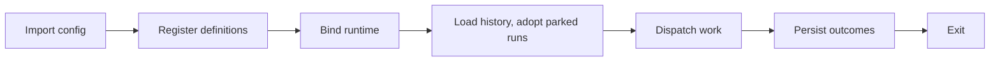
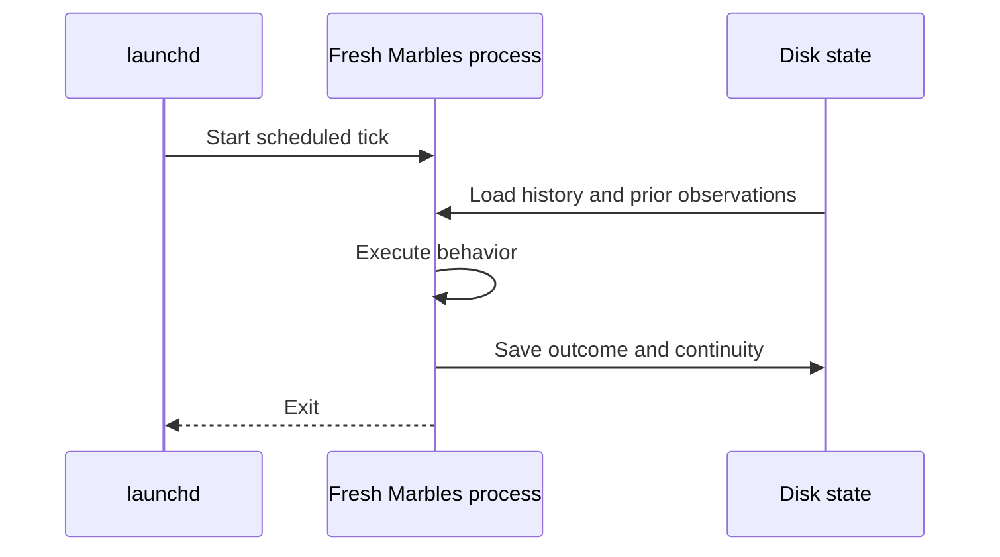

Each command starts a fresh process. First, importing `marbles.config.ts`
registers definitions. Then the CLI binds the runtime step bodies receive:
providers, workspaces, sandboxes, artifacts, sessions, and logging. Finally it
dispatches work.

“Register, then bind” means describing work before choosing its runtime.
It lets one config support inspection, real execution, and dry substitutions.
Calling a word does not execute a step body. Ordinary code at module scope
still runs during import, even for inspection commands.

| Mode | Lifetime |
| --- | --- |
| `marbles roll <name-or-key>` | Dispatch one definition, schedule, or monitor and exit. Cannot answer a question. |
| `marbles` | Keep the dashboard active for schedules, monitors, launches, and answers. |
| launchd | Start a fresh `roll` process for each scheduled tick. |

launchd owns the clock. Marbles owns execution and continuity. Nothing remains
resident between its launchd ticks.

State belongs to the configuration directory. A session continued by
reference reuses its conversation after the previous process exits. A file
monitor compares today's digests with the last handled observation. A
declared artifact gains a version per run.

## What a restart keeps

A run parked on a question or a pause is written to disk as it parks, with
the sessions and sandboxes each step opened, the input each step was locked
with, and the run's own session. A quit, a crash, or a kill does not lose it.
The next dashboard that starts with the same state root and still registers
the step adopts the run, keeps its question open, and on the answer replays
the step body against the recorded sessions.

A run that was mid-body when the process stopped is not resumed. Finished
steps keep their recorded results, but nothing picks the run up; `status`
shows it as orphaned. This is the boundary today: parked work survives,
running work does not.

See [state](/marbles/reference/state) for the layout and the adoption rules,
and [safety and limits](/marbles/safety-and-limits) for dry-run boundaries.
