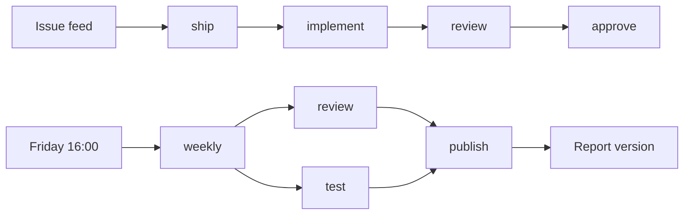

A factory takes materials in, works them at stations, and sends products out.
Software has the same shape. A task comes in; someone implements it, someone
tests it, someone reviews it, someone decides; a branch, a verdict, and a
report come out. This walkthrough builds that line as one `.foundry/marbles/software-factory.ts`,
one station at a time, and then wires it to a clock and a feed.

Every excerpt below is cut from the complete file at the end. Save that file
and every command on this page works.

## The floor plan

Each station is a step. Its input is what arrives; its output is what leaves.

| Arrives | Station | Leaves |
| --- | --- | --- |
| a task | `implement` | a branch |
| the working tree | `test` | an exit code |
| a branch, or a directory | `review` | findings |
| findings | `approve` | a decision |
| findings and an exit code | `publish` | a report version |

Two lines run through the stations. `ship` carries one task from
`implement` through `review` to `approve`. `weekly` runs `review` and `test`
side by side and hands both results to `publish`. A feed starts `ship`; a
clock starts `weekly`.



## Who works here

Definitions are presets. Two agents, a sandbox, and an artifact are enough
for this line.

```ts
const implementer = agent({ prompt: "Implement the task. Keep changes small. Commit when done." });
const reviewer = agent({ prompt: "Review without editing. Reply PASS if satisfied; otherwise list findings." });
const box = sandbox({ image: "docker.io/oven/bun:1-slim", mount: "." });
const weeklyReport = artifact({ name: "Weekly report", type: "text/markdown" });
```

Neither agent names a provider or a model. Omitted, the provider is the first
installed CLI and the model is its default. The prompts state limits: the
reviewer does not edit. The sandbox mounts the step's working directory. The
artifact keeps its identity across runs, so every Friday adds a version to
the same report instead of making a new one.

## Build

A task arrives; a branch leaves. The step cuts a worktree, opens a session in
it, and returns the branch name. The worktree is removed when the callback
returns; the branch survives.

```ts
const implement = step()
  .input(z.object({ task: z.string() }))
  .output(z.string())
  .do(({ input: { task }, agents, workspaces, run }) =>
    workspaces.current.git.withWorktree(
      { base: "main", branch: `task/${run.id}` },
      async (checkout) => {
        const session = await agents.session(implementer);
        await session.generate(task);
        return checkout.branch ?? "";
      }
    )
  );
```

The session is not told where to run. It opens inside the worktree callback,
so it runs in the worktree. The step has no name of its own; it takes the
name of the `const` it is assigned to, and `marbles list` shows it as
`implement`.

## Verify

The working tree arrives; an exit code leaves. Nothing here needs a model.

```ts
const test = step()
  .output(z.number())
  .do(async ({ sandboxes, stream }) => {
    const env = await sandboxes.start(box);
    const result = await env.exec(["bun", "test"]);
    stream.write(result.stdout);
    return result.exitCode;
  });
```

The sandbox's output is written to the step's stream, which the dashboard
shows live. Under `--dry-run` the command is echoed and the exit code is zero.

## Review

A branch or a directory arrives; findings leave. The same step serves both
lines: `ship` gives it a branch, `weekly` gives it a directory.

```ts
const review = step("review")
  .input(z.object({ target: z.string().default("."), branch: z.string().optional() }))
  .output(z.string())
  .do(async ({ input: { target, branch }, agents, log }) => {
    log("reviewing", branch ?? target);
    const session = await agents.session(reviewer);
    const subject = branch ? `branch ${branch} against main` : target;
    return (await session.generate(`Review ${subject}.`)).text;
  });
```

`review` is named explicitly, so it is also launchable on its own:
`marbles roll review` reviews the workspace root.

## Decide

Findings arrive; a decision leaves. This station has a person at it.

```ts
const approve = step()
  .input(z.object({ review: z.string() }))
  .output(z.boolean())
  .do(async ({ input: { review }, ask }) => {
    const { approved } = await ask.approval({ title: "Merge it?", body: review });
    return approved;
  });
```

An approval is a hard block. The run shows as blocked until someone answers
in the dashboard, and it survives the process quitting in between. When the
answer arrives the body replays from the top and the ask returns the recorded
decision, which is why the ask is the first thing the body does: nothing
before it can repeat.

## Publish

Findings and an exit code arrive; a report version leaves.

```ts
const publish = step()
  .input(z.object({ findings: z.string(), exitCode: z.number() }))
  .output(z.string())
  .do(async ({ input: { findings, exitCode }, report }) => {
    const version = await report.artifact(weeklyReport, {
      "report.md": `${findings}\n\nTests exited with ${exitCode}.`,
    });
    return version.id;
  });
```

`report.artifact` writes the version and posts a result entry to the run and
the feed. The step returns the version id, which becomes the workflow's
result.

## Two lines

A line is a tree of locked steps. A parent declares what it needs in its
input; each child is locked under that key and runs first.

```ts
const weekly = workflow(
  "weekly",
  publish.parallel({
    findings: review({}, { target: "." }),
    exitCode: test({}),
  })
);

const ship = workflow("ship")
  .input(z.object({ task: z.string() }))
  .do(({ input: { task } }) =>
    approve({
      review: review({ branch: implement({}, { task }) }),
    })
  );
```

`weekly` needs no input, so its tree is written once. `review` and `test`
run together; `publish` runs when both have returned. `ship` takes a task at
launch, so its tree is built in a setup function: `implement` is locked with
the task, `review` takes the branch it returns, `approve` takes the findings.
Data flows only from a child to its parent. Setup is not durable; it runs
again whenever the run is set up, and the task it locked into `implement` is
what the run records.

## Switches

A clock starts `weekly`. A feed starts `ship`.

```ts
schedule(weekly).at({ weekday: "fri", hour: 16 });

monitor("https://tracker.example.com/issues/latest")
  .every("10m")
  .do(async ({ response }) => ship({}, { task: (await response.json()).title }));
```

The schedule fires at four on Friday afternoon, machine-local time. The
monitor polls the feed every ten minutes and runs its handler when the body
changes; the handler returns a locked `ship`, which starts a run attributed
to the monitor. The first poll has no baseline, so the handler runs once when
the process first starts. A feed that carries a timestamp changes every poll;
read the body and return `undefined` when nothing of interest changed.

## Run the factory

Save the complete file below as `.foundry/marbles/software-factory.ts` in a Git repository.

```sh
marbles --dry-run list
marbles --dry-run roll weekly
marbles --dry-run roll ship --input '{"task":"Add a --json flag to list"}'
```

`list` prints five steps, two workflows, the schedule keyed `weekly`, and the
monitor keyed from its URL. `roll weekly` runs `review` and `test` together,
writes a report version, and prints its id. `roll ship` runs `implement`
and `review`, reaches "Merge it?", and is cancelled at the ask, because
`roll` has nobody to answer. Drop `--dry-run` to perform real model operations,
in a checkout where you intend the agent to make changes.

To run `ship` to completion, open the dashboard with `marbles`, press Enter to
start the triggers, and launch `ship` from the catalog. The run parks at
"Merge it?"; answer it from the feed, with a note if you like, and `approve`
returns the decision. Quit while it is parked and the next dashboard adopts
it. For the Friday schedule without a terminal, see
[launchd](/marbles/guides/launchd).

## What this line does not do

Loops and retries are not available. A rejected `approve` ends the run;
launch `ship` again with the findings appended to the task. `test` verifies
the workspace root, not `implement`'s branch; to test the branch, give
`test` a `branch` input and run it inside a worktree callback the way
`implement` does. The [implement-review pattern](/marbles/use-cases/implement-review)
goes further into that handoff.

## The complete file

```ts
import {
  agent, artifact, monitor, sandbox, schedule, step, workflow,
} from "@foundry/marbles";
import { z } from "zod";

// The floor: who works here and where
const implementer = agent({ prompt: "Implement the task. Keep changes small. Commit when done." });
const reviewer = agent({ prompt: "Review without editing. Reply PASS if satisfied; otherwise list findings." });
const box = sandbox({ image: "docker.io/oven/bun:1-slim", mount: "." });
const weeklyReport = artifact({ name: "Weekly report", type: "text/markdown" });

// Build: a task becomes a branch
const implement = step()
  .input(z.object({ task: z.string() }))
  .output(z.string())
  .do(({ input: { task }, agents, workspaces, run }) =>
    workspaces.current.git.withWorktree(
      { base: "main", branch: `task/${run.id}` },
      async (checkout) => {
        const session = await agents.session(implementer);
        await session.generate(task);
        return checkout.branch ?? "";
      }
    )
  );

// Verify: the working tree becomes an exit code
const test = step()
  .output(z.number())
  .do(async ({ sandboxes, stream }) => {
    const env = await sandboxes.start(box);
    const result = await env.exec(["bun", "test"]);
    stream.write(result.stdout);
    return result.exitCode;
  });

// Review: a branch or a directory becomes findings
const review = step("review")
  .input(z.object({ target: z.string().default("."), branch: z.string().optional() }))
  .output(z.string())
  .do(async ({ input: { target, branch }, agents, log }) => {
    log("reviewing", branch ?? target);
    const session = await agents.session(reviewer);
    const subject = branch ? `branch ${branch} against main` : target;
    return (await session.generate(`Review ${subject}.`)).text;
  });

// Decide: findings become a decision. The ask comes first, so nothing before it repeats on resume.
const approve = step()
  .input(z.object({ review: z.string() }))
  .output(z.boolean())
  .do(async ({ input: { review }, ask }) => {
    const { approved } = await ask.approval({ title: "Merge it?", body: review });
    return approved;
  });

// Publish: findings and an exit code become a report version
const publish = step()
  .input(z.object({ findings: z.string(), exitCode: z.number() }))
  .output(z.string())
  .do(async ({ input: { findings, exitCode }, report }) => {
    const version = await report.artifact(weeklyReport, {
      "report.md": `${findings}\n\nTests exited with ${exitCode}.`,
    });
    return version.id;
  });

// Two lines through the factory
const weekly = workflow(
  "weekly",
  publish.parallel({
    findings: review({}, { target: "." }),
    exitCode: test({}),
  })
);

const ship = workflow("ship")
  .input(z.object({ task: z.string() }))
  .do(({ input: { task } }) =>
    approve({
      review: review({ branch: implement({}, { task }) }),
    })
  );

// Switches: a clock and a feed
schedule(weekly).at({ weekday: "fri", hour: 16 });

monitor("https://tracker.example.com/issues/latest")
  .every("10m")
  .do(async ({ response }) => ship({}, { task: (await response.json()).title }));
```

Continue with the [use cases](/marbles/use-cases) for automations that watch a
repository, remember earlier findings, or keep a correspondence.
