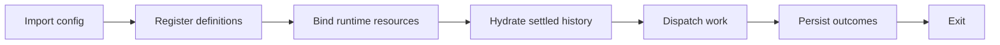
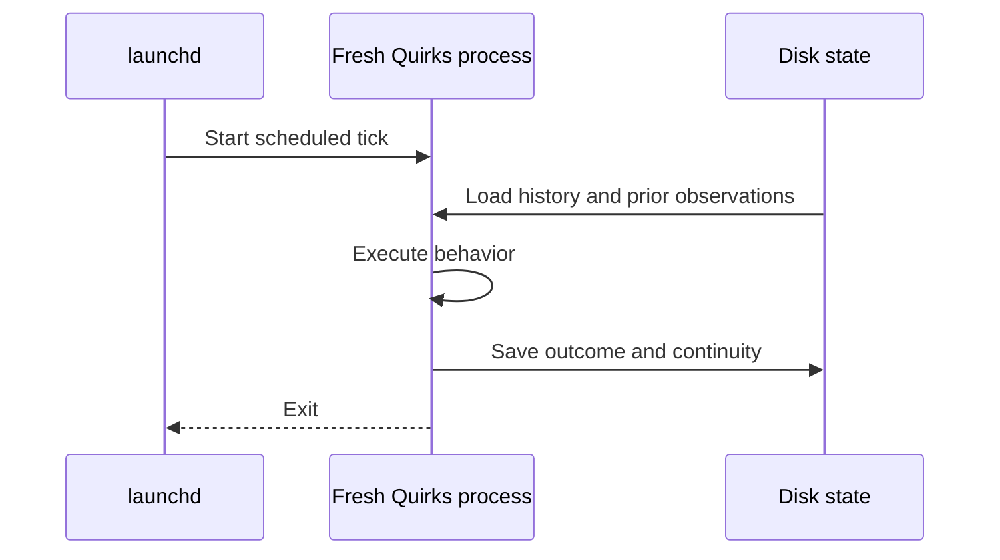

Each command starts a fresh process. First, importing `quirks.config.ts`
registers definitions. Then the CLI binds the resources step bodies receive,
including models, workspaces, sessions, and logging. Finally it dispatches work.

“Register, then bind” means describing work before choosing its runtime resources.
It lets one config support inspection, real execution, and dry substitutions.
Factory calls do not execute step bodies. Ordinary code at module scope still
runs during import, even for inspection commands.

| Mode | Lifetime |
| --- | --- |
| `quirks once <name>` | Dispatch one definition or schedule and exit. |
| `quirks run` | Keep a foreground process active for schedules and live monitors. |
| launchd | Start a fresh `once` process for each scheduled tick. |

launchd owns the clock. Quirks owns execution and continuity. Nothing remains
resident between its launchd ticks.

State belongs to the configuration directory. A named agent session can reuse
conversation history after the previous process exits. A file monitor can
compare today's checksums with yesterday's successful observation. The directory
catalogue itself is in memory and is rebuilt for each runtime.

This is disk-backed continuity, not automatic recovery of interrupted work.
See [state](/quirks/reference/state) for hydration and locks, and
[safety and limits](/quirks/safety-and-limits) for dry-run boundaries.
