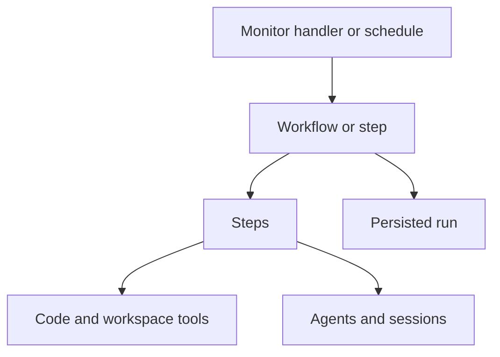

A behavior connects work, observation, timing, and continuity. Five factories
declare those parts in `quirks.config.ts`.

| Factory | What it declares |
| --- | --- |
| `step` | One unit of work, written as an async function. |
| `workflow` | An executable graph composed from steps and workflows. |
| `agent` | Retained instructions, model configuration, and optional skills. |
| `schedule` | A cadence bound to a step or workflow and its input. |
| `monitor` | A source observer and a handler for changes. |

A monitor can handle a change directly. It need not create another workflow.

| Term | Meaning |
| --- | --- |
| Session | A retained agent conversation, separate from a particular run. |
| Run | One dispatched workflow execution, including a directly dispatched step. |
| Workspace | The configuration directory and scope for its persisted state. Without a config, the command's working directory. |
| Workspaces | The runtime primitive for cataloguing and operating on directories and repositories. |
| Harness | An installed coding-agent CLI that executes model turns. Claude Code and Codex are supported today. |

Adding a directory through `workspaces` does not create a new state scope. A
stable session ID belongs to the current Quirks workspace.

Continue with [behaviors as code](/quirks/concepts/behaviors-as-code).
