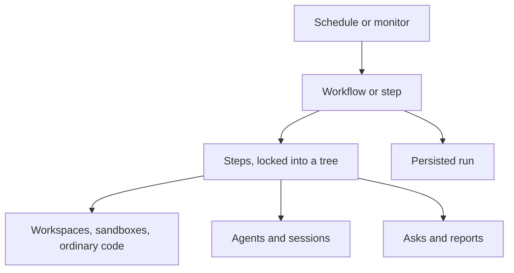

A behavior connects work, observation, timing, and continuity. Nine words
declare those parts in `quirks.config.ts`. Calling one registers it; nothing
is exported.

| Word | Kind | What it declares |
| --- | --- | --- |
| `step` | work | One unit of work: optional input and output schemas, then a body. |
| `workflow` | work | A name around a tree of steps, or setup that returns one. |
| `agent` | definition | Who does model work: a prompt, optionally a provider, a model, and skills. |
| `workspace` | definition | Another directory to work on. The config's own is implicit. |
| `sandbox` | definition | An isolated place to run commands, mounting a workspace or seeded with files. |
| `artifact` | definition | A versioned output that keeps its identity across runs. |
| `skills` | definition | A set of skills an agent takes, built by chaining. |
| `schedule` | trigger | A cadence bound to a step or workflow, bare or locked with input. |
| `monitor` | trigger | A file glob or an HTTP source, polled, with a handler for changes. |

Definitions are presets. A step body can create the same things on the spot
through its context.

```mermaid
flowchart TD
    T[Schedule or monitor] --> W[Workflow or step]
    W --> S[Steps, locked into a tree]
    S --> C[Workspaces, sandboxes, ordinary code]
    S --> A[Agents and sessions]
    S --> R[Asks and reports]
    W --> P[Persisted run]
```

A monitor can handle a change directly, or return a locked node to start a
workflow.

| Term | Meaning |
| --- | --- |
| Lock | Calling a definition with children and literal input, which makes one node. |
| Tree | Locked nodes wired by reference; children run before their parent and hand it their results by key. |
| Run | One dispatched workflow or step, with its own session, stream, and cancellation. |
| Context | The one object a step body receives: `input`, `agents`, `workspaces`, `sandboxes`, `artifacts`, `ask`, `report`, `log`, `stream`, `signal`, `run`. |
| Session | A retained agent conversation, continued by reference within a run or across runs. |
| Workspace | The directory that holds the config, and the scope of its persisted state. Without a config, the working directory. |
| Provider | An installed coding-agent CLI that runs model turns. Claude Code and Codex are supported today. |
| Key | What names a schedule or monitor: derived from its target and input, or its source. |

Continue with [behaviors as code](/quirks/concepts/behaviors-as-code).
